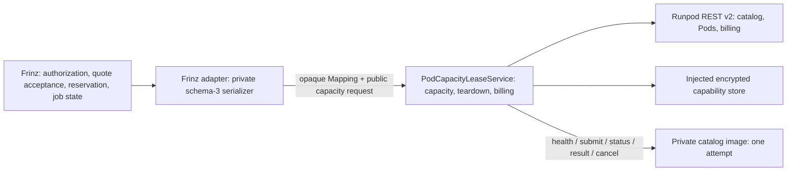

# Catalog Pod capacity

## Decision

LoRA is the first production workload for the generic dedicated-Pod lane. It
is not deferred behind inference work. `kestrel-cloud-runpod` 0.7 exposes one
canonical `PodCapacityLeaseService`; the pre-0.7 training names are
compatibility aliases over that same service, provider, repository, and table.

The package uses only Runpod REST v2. It has no v1, GraphQL, legacy SDK, or
private-catalog fallback.

## Ownership boundary



Frinz remains authoritative for the catalog job, user consent, funds
reservation and settlement, artifact capabilities, verification, and atomic
promotion. The private `frinz_catalog_contracts` serializer remains the only
request/result schema implementation and is distributed from its private
GitHub release. It is not on PyPI and is never imported, vendored, or
reserialized by this public package.

Cloud owns only the billable resource and its narrow transport:

- live v2 catalog placement and exact GPU ID/name/hourly price;
- startup, execution, maximum-runtime, estimated-cost, and ceiling evidence;
- durable owner/workload/attempt/idempotency/cleanup-family binding;
- immutable image, parameter, and canonical request digests;
- scoped capability injection and recovery through a host-owned encrypted
  store;
- deterministic create recovery, readiness, deadlines, termination, and
  `/billing/pods` attribution; and
- content-free workload observations and billing receipts.

## Quote and acquisition

`PodCapacityQuoteRequest` is content-free. For LoRA, its
`parameters_sha256` is the SHA-256 of canonical JSON containing exactly
`steps`, `rank`, `seed`, `learning_rate`, and `resolution`. The quote ID binds
that digest, constraints, selected v2 offer, rate, timing, and observation.

Cost is rounded upward to six decimal USD places:

```text
estimated_cost = ceil_usd(hourly_rate * (startup + execution) / 3600)
cost_ceiling   = ceil_usd(hourly_rate * maximum_runtime / 3600)
```

Acquisition fails unless the caller accepts exactly `cost_ceiling`, the quote
is still live, and the hard deadline cannot exceed the quoted maximum runtime.
The provider re-queries v2 immediately before create and constrains placement
to the exact quoted GPU ID and no higher hourly rate.

## One Pod, one attempt

The service loads or creates one durable capability through
`CatalogAttemptCapabilityStore` and injects:

```text
CATALOG_WORKER_MODE=pod
CATALOG_POD_ATTEMPT_ID=<attempt>
CATALOG_POD_BEARER_TOKEN=<scoped random bearer>
CATALOG_POD_BEARER_EXPIRES_AT=<aware timestamp>
CONTAINER_DIGEST=sha256:<immutable image digest>
```

Database and Runpod control-plane credentials are rejected from attempt
environment input. The bearer expiry must cover the hard runtime plus teardown
envelope and cannot exceed the worker's 24-hour bound. Durable/public state
contains only the secret ID, token digest, and expiry.

The worker interface is deliberately small: anonymous `GET /health`, then
bearer-authenticated `POST /v1/catalog/jobs/{attempt}`, `GET` status, `GET
/result`, and `POST /cancel`. The body/result are opaque mappings. Cloud checks
only the attempt and request-hash bindings needed to prevent cross-attempt
delivery; the private package validates the complete schema and artifact
receipt.

`retrieve_catalog_result()` is an authenticated, non-destructive replay. The
private host strict-decodes and durably commits that opaque result first, then
calls `acknowledge_catalog_result()` with the same capacity/owner/workload
identity. Acknowledgement is the destructive boundary: it records
`RESULT_RETRIEVED`, permanently terminates the disposable Pod, and begins
billing reconciliation. A crash before the private database commit can replay
the worker result after restart; cloud never persists the private payload.

## Crash and ambiguity rules

The lease and deterministic resource name are committed before `POST /pods`.
A timeout, connection loss, cancellation, malformed success, or unexpected
realized placement never causes an immediate second create. Reconciliation
lists by the exact deterministic name and validates image digest, GPU ID/count,
and cloud:

- zero matches remains nonterminal and billing-unresolved for later polling;
- one exact match is adopted and terminated when the original operation could
  not safely continue;
- multiple matches or any immutable-field mismatch fails closed and stops no
  unrelated resource.

Every workload terminal path, explicit cancellation, readiness failure,
orphan, and hard deadline permanently terminates owned disposable capacity.
Cancellation intent is durable before the authenticated worker cancel; a late
success can therefore never be returned for promotion.

## Billing and polling

After v2 confirms termination, the lease remains `RELEASING` with billing
`PENDING`. A cheap external timer calls `reconcile()`; no resident in-process
owner is required. The service filters `/billing/pods` by the exact Pod ID and
persists a content-free provider billing ID, interval, billed seconds, accepted
hourly price, and `actual_cost_usd`. Only then does the catalog lease become
`RELEASED` and settlement-ready. A definitive pre-provider rejection records
an authoritative zero; an ambiguous create with no visible Pod remains
nonterminal and must not release a Frinz reservation as zero.

Frinz compares the authoritative actual cost with the accepted ceiling. An
over-ceiling bill is retained as evidence but settlement remains fail-closed;
cloud never owns or mutates the funds ledger.

The installed `kestrel-runpod-reconcile-capacity` command is the canonical
external driver. `RUNPOD_POD_CAPACITY_SERVICE_FACTORY=module:callable` names a
host-owned synchronous factory which wires the public service to Runpod auth,
the absolute SQLite path, GPU profiles, the private encrypted capability store,
and the opaque worker transport. The command validates those dependencies
before polling, obtains a process advisory lock derived from that one database,
and calls only `reconcile()` under a configured timeout. It cannot quote,
acquire, submit, or otherwise provision work. Its JSON contains aggregate state
counts only; stable exit statuses distinguish success, retryable/busy state,
configuration failure, and a typed runtime failure.

## Spin-up and storage policy

Every live launch gate records placement, image pull, model load, execution,
upload, cleanup tail, and actual billed cost. The initial choice remains:

| Mode | Spin-up and cost shape | Initial use |
| --- | --- | --- |
| Serverless, zero workers | Queue/cold start; pay for execution rather than idle Pod | Bursty inference when measured reliability and cost win |
| Single-attempt Pod | Placement plus image/model load; continuous billing until termination | LoRA training and amortized batches |
| Local Mac Studio MPS | No cloud invoice; fixed local capacity and slower execution | Explicit privacy/rollback baseline |
| Private Ollama | Serverless load balancer for bursty sessions or a bounded dedicated Pod for sustained sessions | Interactive agent inference, separately quoted from catalog jobs |

Model data should be pinned in the image or a verified portable cache first.
A network volume is not a default: it has its own charge and constrains Pod
placement to one data center, recreating the old capacity-in-the-same-zone
failure. Adopt one only when repeated cold-start and actual-cost evidence beats
the portable path.
