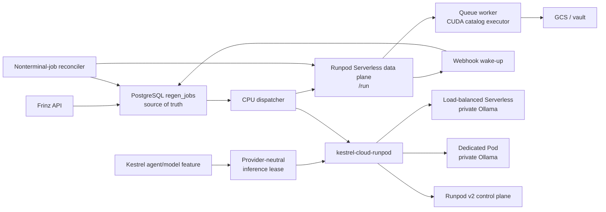
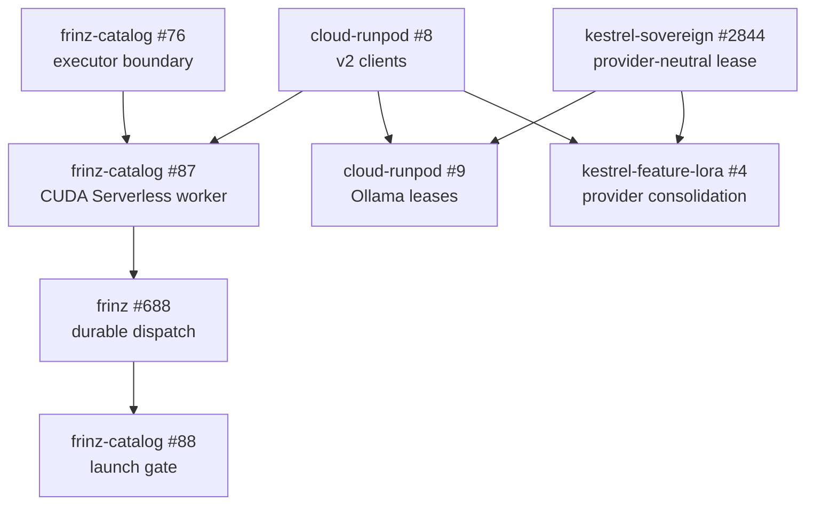

# Runpod v2 execution platform

**Status:** Accepted for staged delivery

**Date:** 2026-08-01

**Epic:** [kestrel-cloud-runpod#7](https://github.com/KestrelSovereignAI/kestrel-cloud-runpod/issues/7)

## Context

Kestrel's Runpod integration predates Runpod Serverless. It creates and manages Pods through legacy module-level Python SDK and GraphQL behavior, keeps only one active session in process memory, and relies on a TTL that is not an external billing-safety mechanism. GPU identifiers, prices, availability, and startup estimates are also embedded in local profiles.

That design was reasonable when inexpensive GPU capacity was scarce and model downloads made every replacement Pod expensive. Persistent disks and stopped Pods reduced repeat downloads, but tied the workload to a host or data-center capacity pool. Current Runpod provides a beta v2 REST control plane, queue and load-balancing Serverless endpoints, a live compute catalog, model caching, and billing records. These capabilities change the correct boundary: Kestrel should dispatch work to reusable execution services and manage durable leases, not recreate the old Pod lifecycle around a newer SDK.

This record defines one vendor boundary for two workload families:

1. Frinz catalog selfie/image inference, dispatched asynchronously to queue-based Serverless workers while PostgreSQL remains authoritative.
2. Private Ollama inference, leased through load-balanced Serverless for bursty interactive sessions or a dedicated Pod for sustained sessions.

LoRA training is intentionally outside the first launch. Its future Runpod path must reuse this platform rather than create another provider implementation.

## Decision

`kestrel-cloud-runpod` will own a typed, v2-only Runpod integration. Runpod's v1 REST control plane remains supported and generally available during the beta migration, but new Kestrel production code will not call `rest.runpod.io/v1`. It also will not call the legacy GraphQL infrastructure API or private helpers from the Runpod Python CLI. There is no automatic v1 or GraphQL fallback. Choosing the beta v2 API for new work accepts additional contract-churn risk in exchange for building on Runpod's stated forward platform; the OpenAPI pin, drift gate, and injectable base URL below contain that risk without silently reverting to an older surface.

Runpod exposes two separate v2 services, and the distinction is part of the contract:

| Service | Canonical base URL | Responsibility |
| --- | --- | --- |
| Control plane | `https://v2-rest.runpod.io/v2` | GPU/CPU/data-center catalog, Pods, Serverless endpoint definitions and workers, volumes, registries, and billing |
| Serverless data plane | `https://api.runpod.ai/v2` | Queue job `/run`, `/status`, `/cancel`, `/retry`, and `/health` operations; endpoint-specific load-balanced traffic |

The production control-plane base comes from Runpod's [official MCP/reference client's v2 configuration](https://github.com/runpod/runpod-mcp/blob/main/docs/configuration.md). The current [v2 OpenAPI document](https://v2-rest.runpod.io/v2/openapi.yaml) has a different `servers` value, so clients must not derive the production host from that field while v2 is beta. Both base URLs are declared once, are injectable for tests, and remain explicitly pinned to v2.

The Python `runpod` package may still be used inside a worker container for `runpod.serverless.start`. It will not be used as the infrastructure control-plane client.

## System boundaries



The Frinz catalog queue and the Kestrel inference-lease store are independent durability boundaries. They share the typed Runpod clients and placement policy, not a combined state machine.

## Canonical package contracts

Implementation under [#8](https://github.com/KestrelSovereignAI/kestrel-cloud-runpod/issues/8) will replace the legacy provider rather than add a parallel client.

### Typed transport

The package will expose two authenticated clients behind provider-neutral services:

- `RunpodControlPlaneClient` for catalog, Pod lifecycle, Serverless endpoint lifecycle, workers/logs, and billing.
- `RunpodServerlessClient` for queue job lifecycle and endpoint health. Load-balanced callers use the URLs returned by the control plane rather than reconstructing vendor URLs in consumer repositories.

The transport must:

- use bearer authentication without module-global credentials;
- use explicit connect and read timeouts;
- parse `application/problem+json` responses into typed errors;
- respect `Retry-After`, `RateLimit`, and `RateLimit-Policy` headers;
- retry only operations known to be safe and idempotent;
- preserve enough request/resource context for actionable logs without recording credentials, prompts, or signed artifact URLs; and
- expose a test transport so the full success and failure contract is exercised without provisioning live resources.

Create requests are not automatically retried after an ambiguous timeout or connection failure. The caller first persists an attempt identity and desired-resource fingerprint. An ambiguous result enters `reconcile_required`; the reconciler searches for the accepted resource and records its provider ID before any replacement request is authorized. This rule prevents a network timeout from creating unbounded duplicate Pods or endpoints.

### OpenAPI pin and drift detection

The beta API contract will be treated as an external dependency with an explicit upgrade process:

1. Vendor the reviewed [v2 OpenAPI YAML](https://v2-rest.runpod.io/v2/openapi.yaml) with its source URL, retrieval date, and SHA-256 checksum.
2. Generate or validate typed request/response models deterministically from that pinned document.
3. Commit generated artifacts only when they are required at runtime; otherwise make CI prove regeneration produces no diff.
4. Add contract tests for every operation the package uses, including list envelopes, nullable fields, action schemas, and RFC 9457 errors.
5. Add a scheduled/manual drift check that fetches the live schema, reports the semantic diff, and opens or fails with an actionable update requirement. It must not silently overwrite the pin.
6. Keep authenticated smoke tests opt-in and read-only by default. Mutating smoke tests require an explicit disposable-resource fixture and guaranteed teardown.

An additive upstream field does not require an emergency release. A removed/renamed field, enum narrowing, required-field change, path change, or security change blocks a client upgrade until reviewed. The OpenAPI document is authoritative for shapes, but not for choosing the production base URL while the documented beta discrepancy remains.

## Catalog, placement, pricing, and billing

Placement begins with the live v2 catalog, not a configured SKU name or hourly price. A request describes constraints such as:

- product (`SERVERLESS` or `POD`), GPU count, minimum VRAM, and minimum CUDA version;
- Secure or Community Cloud policy and allowed data centers;
- permitted GPU pools or hardware families;
- maximum estimated hourly rate and maximum authorized total cost; and
- workload benchmark identity, such as `catalog-pulid` or `ollama-interactive`.

The client queries `/catalog/gpus` with the availability expansion and product context. Placement first rejects candidates that violate hard privacy, region, CUDA, memory, or budget requirements. It then ranks remaining candidates by availability, measured workload performance, and effective cost. Every decision records the catalog timestamp, selected pool/type, offered rate, constraints, and benchmark version so it can be explained later.

Marketing SKU names are useful benchmark labels, not durable API identifiers. The initial benchmark matrix includes PRO 6000 MIG 1g.24gb, PRO 6000 MIG 2g.48gb, RTX PRO 4500, and RTX PRO 4000 Blackwell, but production configuration will use identifiers/pools returned by v2 and validated by the pinned schema.

Estimates use the live placement rate. Actual spend is reconciled from `/billing/serverless` or `/billing/pods` and attributed back to the catalog job or inference lease. A price change therefore affects a new placement decision without requiring a code release, while existing decisions remain auditable.

## Choosing an execution mode

| Mode | Use | Backpressure and lifecycle | Cost/latency posture |
| --- | --- | --- | --- |
| Queue-based Serverless | Catalog image jobs and other finite asynchronous work | Runpod queues work and exposes job status/cancel/retry; Kestrel retains durable orchestration | Scale to zero by default; accept measured cold start in exchange for no idle Pod |
| Load-balanced Serverless | Interactive Ollama/native HTTP streaming | Direct request routing, no durable queue and no automatic backlog handling; callers retry readiness/no-worker responses safely | Scale to zero for bursty sessions, with an intentional warm idle window |
| Dedicated Pod | Sustained Ollama sessions, development/benchmarking, and future long-running workflows | Kestrel owns a durable lease, readiness, hard deadline, and external termination reconciliation | Prefer only when expected utilization makes the live Pod rate cheaper than Serverless initialization plus warm time |

Runpod documents the behavior and tradeoffs of [queue and load-balancing endpoints](https://docs.runpod.io/serverless/load-balancing/overview). A catalog request never creates a Pod: it submits to a provisioned endpoint and lets Runpod scale workers. Endpoint definitions are managed declaratively through the v2 control plane and reused across jobs.

Endpoint policy is measured per workload. Initial safe defaults are minimum workers zero, a bounded maximum worker count, FlashBoot enabled, and explicit queue/idle/execution timeouts. Production values are outputs of the benchmark gate, not constants in this record.

## Catalog execution and reconciliation

PostgreSQL `regen_jobs` remains the sole source of truth for client-visible catalog job identity and state. The Runpod queue is an execution transport.

The catalog path will be split into:

1. A canonical device-neutral request/result contract and engine router.
2. The existing local MPS executor.
3. A CUDA executor packaged as a queue-based Serverless worker.
4. A cheap CPU dispatcher, idempotent webhook handler, and low-frequency reconciler in Frinz.

The dispatcher atomically claims eligible work, constructs a normalized request, and submits it using `/run`. It never holds a database transaction across the network call. Provider endpoint ID, job ID, attempt ID, dispatch timestamps, status, typed error, and telemetry are persisted before the local claim is released.

The Serverless worker processes exactly one normalized job and never polls Cloud SQL or receives database credentials. Inputs and output targets are narrowly scoped, time-limited capabilities. The worker uploads directly to GCS/vault and returns a small artifact receipt rather than generated bytes. This avoids coupling correctness to Runpod's result-retention window; Runpod documents 30-minute retention for asynchronous results in its [operation reference](https://docs.runpod.io/serverless/endpoints/operation-reference).

Runpod [webhooks](https://docs.runpod.io/serverless/endpoints/send-requests#webhook-notifications) have limited retries. No signed webhook-verification contract is currently documented, so callbacks are untrusted wake-up hints. The handler validates the endpoint/job/attempt association and re-fetches authoritative status with a restricted Serverless credential before committing terminal state. Duplicate and out-of-order callbacks are harmless.

A reconciler polls only nonterminal submitted jobs using bounded exponential cadence. It recovers webhook loss, process crashes, ambiguous submissions, and teardown failures. Cancellation propagates to `/cancel`; a late result for a cancelled or superseded attempt cannot publish an artifact.

## Model and artifact storage

Catalog inputs and outputs remain in canonical Kestrel storage. Network volumes are not the default artifact store.

For model weights, prefer in order:

1. Runpod [cached models](https://docs.runpod.io/serverless/endpoints/model-caching) when one large Hugging Face repository maps cleanly to an endpoint.
2. Reproducibly baked private/smaller weights in the worker image.
3. A network volume only when benchmark evidence justifies its operational constraints.

Runpod currently limits an endpoint to one cached model repository. A single network volume restricts execution to its data center; multiple volumes do not synchronize automatically, and concurrent writers require coordination. These [network-volume constraints](https://docs.runpod.io/storage/network-volumes) recreate part of the old capacity/zone problem, so a volume is an explicit placement constraint and cost, never an invisible cache assumption.

## Durable resource leases and cleanup

Every billable Pod and every logically reserved interactive endpoint/session must have durable ownership. In-memory TTL state is not sufficient.

A lease records at least:

- stable lease and owner/workload IDs;
- requested model/runtime and placement constraints;
- provider resource type, ID, endpoint URLs, and operation-attempt identity;
- created, readiness, last-used, idle-deadline, and hard-deadline timestamps;
- catalog snapshot/rate, maximum authorized spend, estimated spend, and reconciled actual cost;
- lifecycle state, last typed provider error, and teardown state; and
- idempotency and reconciliation metadata.

Creation, readiness, use, release, expiry, and teardown are explicit state transitions. Teardown never clears the provider ID before Runpod confirms termination. A periodic process outside the requesting agent terminates expired or orphaned Pods and keeps failures visible and retryable across restarts.

Runpod notes that Pods with network volumes cannot be stopped, only terminated, and that a restarted Pod may receive zero GPUs when capacity changes. The provider therefore does not promise cheap resume as an availability strategy; it follows the current [Pod lifecycle contract](https://docs.runpod.io/pods/manage-pods).

## Private Ollama

Private Ollama is a separate workload contract from the catalog worker.

The model feature selects a model. A provider-neutral inference-lease service acquires private capacity and returns a bounded route only after readiness. `kestrel-cloud-runpod` implements that provider contract without exposing Runpod concepts in Kestrel core.

For bursty interactive sessions, the default candidate is load-balanced Serverless because Ollama's native HTTP and streaming contract requires direct routing. The endpoint must report healthy and `/api/tags` must show the requested model before Kestrel switches `LLMService` to the route. The caller handles load-balancer no-worker/initialization responses with bounded retry and never treats them as queued work. Runpod provides separate examples for [Ollama on Serverless](https://docs.runpod.io/tutorials/serverless/run-ollama-inference) and [Ollama on a Pod](https://docs.runpod.io/tutorials/pods/run-ollama).

For long or continuously active sessions, a dedicated Pod is considered using live catalog data. The decision compares expected utilization against both alternatives:

```text
serverless_estimate = serverless_rate * (initialization + execution + idle_tail)
pod_estimate        = pod_rate * lease_duration
```

Storage, model transfer, and failure/retry costs are added to both estimates. A Pod is selected only when it fits the cost cap and measured readiness target. Model pull and model-to-VRAM load are part of cold-start time and billable session cost.

Queue-based Serverless remains valid for non-streaming batch inference but is not the interactive Ollama default. If the real requirement becomes high-throughput OpenAI-compatible serving rather than Ollama compatibility, vLLM should be evaluated as a separate runtime behind the same lease contract.

## MCP boundary

Runpod's [official MCP server](https://github.com/runpod/runpod-mcp) is a valuable operator tool and a reference client for the beta API. It is not a production dependency of the catalog dispatcher or inference-lease service.

The MCP server acts with the supplied API key's permissions. Product agents therefore do not receive unrestricted Runpod MCP/control-plane tools. They receive constrained provider-neutral operations such as acquire, status, and release for resources they own, with privacy, placement, deadline, and cost policies enforced before infrastructure changes. Operators may use MCP separately for inspection and emergency cleanup under appropriately scoped credentials.

## Security and privacy

- Use newly issued [restricted Runpod API keys](https://docs.runpod.io/get-started/api-keys) with separate control-plane and endpoint/job permissions where possible.
- Do not put a control-plane credential in a GPU worker image or catalog request.
- Store credentials in the configured secret system; never in tracked TOML, logs, telemetry, or durable job payloads.
- Authorize every lease and job status operation by stable owner/workload identity.
- Use short-lived, operation-scoped input and output capabilities. Validate destination allowlists and reject arbitrary artifact URLs to prevent SSRF or data exfiltration.
- Redact prompts, avatar references, signed URLs, model credentials, and provider response bodies that may contain them.
- Treat callbacks as untrusted until provider status is re-fetched and correlated with endpoint, job, and attempt IDs.
- Fail closed when privacy, region, GPU, readiness, or cost requirements cannot be satisfied. There is no silent switch between local and cloud execution.

## Cold-start, performance, and cost telemetry

Runpod bills Serverless workers from start until full stop, including initialization and idle tail, as described in its [Serverless pricing documentation](https://docs.runpod.io/serverless/pricing). A cheap GPU with a slow or failure-prone startup can be more expensive per successful artifact than a higher hourly-rate GPU.

Each catalog job and inference lease records:

- dispatch/provisioning duration;
- Runpod queue `delayTime` and worker cold-start metrics;
- image pull, model availability/download, and model-to-RAM/VRAM load durations;
- execution and artifact upload duration;
- warm reuse and idle-tail seconds;
- peak VRAM and host RAM;
- success, timeout, OOM, cancellation, and startup-failure outcome;
- offered rate, estimated cost, and v2-billing actual cost; and
- engine/model/container/benchmark versions and selected GPU pool/type.

Runpod defines delay time as including worker cold start and exposes delay/execution fields in its [benchmarking guide](https://docs.runpod.io/serverless/development/benchmarking). Kestrel adds application-level initialization spans so queueing, image pull, and model load can be separated. Decisions use distributions—at minimum p50 and p95—not a single successful run.

Production routing is gated on measured cold and warm scenarios, two- and five-job bursts, failure/cancellation behavior, image quality versus the local MPS executor, and cost per successful job. Idle timeout and minimum-worker settings are tuned from observed inter-arrival time and latency targets. Static marketing startup claims and hardcoded profile costs are not acceptance evidence.

## Delivery plan and issue ownership

Work is staged so each repository changes only the behavior it owns:

1. [kestrel-cloud-runpod#8](https://github.com/KestrelSovereignAI/kestrel-cloud-runpod/issues/8) — typed v2-only control/data-plane clients, pinned OpenAPI contract, live placement, and billing.
2. [frinz-catalog#76](https://github.com/KestrelSovereignAI/frinz-catalog/issues/76) — extract one device-neutral executor/router while preserving the current local MPS worker.
3. [frinz-catalog#87](https://github.com/KestrelSovereignAI/frinz-catalog/issues/87) — build the CUDA executor and queue-based Serverless worker without PostgreSQL credentials.
4. [frinz#688](https://github.com/KestrelSovereignAI/frinz/issues/688) — add durable Serverless dispatch, webhook verification-by-refetch, reconciliation, cancellation, and artifact publication.
5. [frinz-catalog#88](https://github.com/KestrelSovereignAI/frinz-catalog/issues/88) — benchmark cold start, VRAM, quality, reliability, and actual cost before cutover.
6. [kestrel-sovereign#2844](https://github.com/KestrelSovereignAI/kestrel-sovereign/issues/2844) — define the provider-neutral remote inference lease and readiness-gated route integration.
7. [kestrel-cloud-runpod#9](https://github.com/KestrelSovereignAI/kestrel-cloud-runpod/issues/9) — implement that contract with durable private Ollama leases and Serverless-versus-Pod selection.
8. [kestrel-feature-lora#4](https://github.com/KestrelSovereignAI/kestrel-feature-lora/issues/4) — migrate the LoRA package's own stale adapter after the canonical v2 provider (#8) and provider-neutral registration boundary (#2844) exist. The catalog dispatcher (#688) and Ollama implementation (#9) are parallel consumers, not prerequisites for this cleanup.

Catalog LoRA training remains deferred context in [frinz-catalog#77](https://github.com/KestrelSovereignAI/frinz-catalog/issues/77); it is not a launch dependency for selfie inference.



The local Mac executor stays available as an explicit configured backend throughout the catalog migration. Canarying and rollback select that backend deliberately; a Runpod failure does not silently reroute private work.

## Launch gates

The platform is not production-ready until all applicable gates pass:

- no production infrastructure call uses v1 or GraphQL;
- pinned-schema contract and drift tests pass;
- every billable resource is attributable and externally reclaimable after process failure;
- ambiguous create, duplicate callback, webhook loss, cancellation, late completion, and teardown failure paths are tested;
- catalog artifacts publish exactly once and workers have no database credential;
- private Ollama routes activate only after the requested model is ready;
- restricted credentials and privacy/cost constraints are verified;
- cold-start p50/p95, execution p50/p95, VRAM, success rate, quality, and cost are inside approved thresholds; and
- actual v2 billing reconciles with estimates closely enough to enforce budget limits.

## Consequences

Positive consequences:

- one Runpod implementation and one place to track the beta API;
- current availability and pricing replace stale configuration;
- scale-to-zero catalog capacity without sacrificing the existing durable job contract;
- private on-demand inference with enforceable ownership and teardown; and
- cost and cold-start behavior become measured routing inputs.

Costs and tradeoffs:

- the beta control plane requires schema pinning, drift monitoring, and deliberate upgrades;
- CUDA portability is a real engine refactor, not a handler wrapper;
- webhook reconciliation and durable leases add state-machine work;
- load-balanced scale-to-zero Ollama can return temporary no-worker responses during initialization; and
- network-volume placement improves persistence but can reduce GPU availability and adds synchronization responsibilities.

These costs are accepted because reviving the old in-memory Pod manager would leave duplicate-resource, orphan-billing, stale-price, and data-center coupling risks unresolved.
